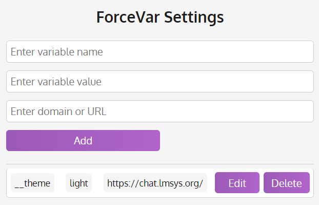

  
  <i><b>
ForceVar - Force Query Vars Without Much Hassle
</b></i>

Forcevar is a lightweight and convenient browser extension at the moment supporting any Chromium-based browser. Control the states and hidden configs of any website with a few clicks. No technical expertise required!

## What is a Query Variable?

A query variable is a part of a URL that is used to pass data to a web page, or from one web page to another. It is a string of characters that comes after a question mark in a URL. For example, in the URL `https://www.example.com/page?var1=value1&var2=value2`, the query variables are `var1=value1` and `var2=value2`.

## Why ForceVar?

ForceVar is very lightweight and easy to use for anyone, even if you don't even know how to code. Additionally, it's open-source, so updates and new features are always on the way. It's also free and will always be free. No strings attached.

# Installing ForceVar

As of now, ForceVar is only available for Chromium-based browsers, and, sadly, not downloadable from the Chrome Web Store. However, you can still install it by following the steps below:

1. Download the latest release from the [Releases](https://github.com/LyubomirT/forcevar/releases) page, we usually have a `.zip` with everything you need for each release.

2. Unzip the downloaded file using whatever tool you prefer.

3. Open your browser and navigate to the extensions page. You can do this by typing `chrome://extensions` in the address bar and pressing Enter (for Chrome) or `edge://extensions` (for Edge).

4. Enable Developer Mode by clicking the toggle switch next to Developer mode, it's required to install extensions from outside the Chrome Web Store.

5. Click the "Load unpacked" button and select the folder where you unzipped the downloaded file (not the contents of the folder!).

6. You're done! You should see the ForceVar icon in your browser's toolbar. Click it to start using ForceVar.

# Setting stuff up

You may have already noticed the ForceVar interface in the screenshot above. The window itself is pretty much self-explanatory, but here's a quick rundown of how to use it if you're having trouble:

1. **Enter the Variable Name** - This is the topmost input field in the window. Here, you can enter the name of the query variable you want to force. Let's say that you want to force the `theme` query variable. You would enter `theme` in this field.

2. **Enter the Variable Value** - This is the second input field in the window. Over here you need to enter the value of the forced query variable. If you want to force the `theme` query variable to `dark`, you would enter `dark` in this field.

3. **The URL** - This is the URL of the website you want to force the query variable on. You can enter the URL of the website in this field. For example, if you need to set the `theme` query variable on `https://www.example.com`, you would enter `https://www.example.com` in this field.

4. **Hit the "Add" button** - And you're done! The next time you load into the website, the query variable will be forced (check the URL bar to see the changes... or the page itself, depending on what you're forcing).

> [!NOTE]
> Variable naming rules apply to this, there is a list of disallowed characters for the query variables. The app will notify you if you're using a disallowed character and will ask you to change it.

## Modifying your settings

Okay, so you've forced a query variable on a website. But what if that variable doesn't interest you anymore? Or what if you want to set it to something else? This usually is done quite simply.

Each forced variable has "Edit" and "Delete" buttons next to it, with their respective actions. Clicking "Edit" will fill in the fields with the data of the forced variable, allowing you to change it. Clicking "Add" will bring back the edited variable to the list, but with the new data.

Clicking "Delete" will remove the forced variable from the list, and it will no longer be forced on the website (you may need to refresh the page to see the changes).

## Where is the data stored?

The data is stored in the browser's local storage and is not shared with anyone. It's only accessible to you and the extension itself. That data is automatically loaded whenever you load the extension or the browser, so you don't have to worry about losing your forced variables.

## I've found a bug!

If you've found a bug, please report it in the [Issues](https://github.com/LyubomirT/forcevar/issues) section of the GitHub repository. We'll try to get to it as soon as possible, but we also appreciate any help from you and the community. If you're a developer, feel free to fork the repository and submit a pull request with the fix if you can.

## What's next?

We're planning to add a lot of features to ForceVar, including but not limited to:

- Support for Firefox and other non-Chromium browsers
- A more customizable interface
- A way to export and import your configurations
- Kind of a "dark mode" for the extension
- A way to remove query variables from the URL if they're forced by the website itself

We're also open to suggestions, so if you have any ideas for new features, feel free to submit them in the [Discussions](https://github.com/LyubomirT/forcevar/discussions) section of the GitHub repository. We'll be happy to hear from you!

## License

ForceVar is licensed under the [BSD 3-Clause License](LICENSE). You can use it for whatever you want, but you must retain the copyright notice and the list of conditions and the following disclaimer. You can also redistribute it in source and binary forms, with or without modification, but you must follow the conditions listed in the license.

## Credits

ForceVar is developed and maintained by [Lyubomir Ternavskiy](https://github.com/LyubomirT). The icon was made by using [Canva](https://www.canva.com/), and the README was written using [Markdown](https://www.markdownguide.org/). The extension itself is built using [HTML](https://www.w3schools.com/html/), [CSS](https://www.w3schools.com/css/), and [JavaScript](https://www.javascript.com/).

## Support

The best way to contact us is through the [Issues](https://github.com/LyubomirT/forcevar/issues) section of the GitHub repository or the [Discussions](https://github.com/LyubomirT/forcevar/discussions) section. We'll try to get to your issue or suggestion as soon as possible. You can also contact us through the email (`ternavski103@gmail.com`) or the [Discord](https://discord.gg/4nVVhh29E3) server.

## Disclaimer

ForceVar is provided "as is" and without any warranty. We are not responsible for any damage caused by the use of ForceVar. Use it at your own risk. We are also not responsible for any damage caused by the use of the forced query variables. Use them at your own risk.

## Contributing

Thank you for considering contributing to ForceVar! The contribution guide can be found in the [CONTRIBUTING.md](CONTRIBUTING.md) file. We appreciate any help from the community, and we'll try to get to your pull request as soon as possible.